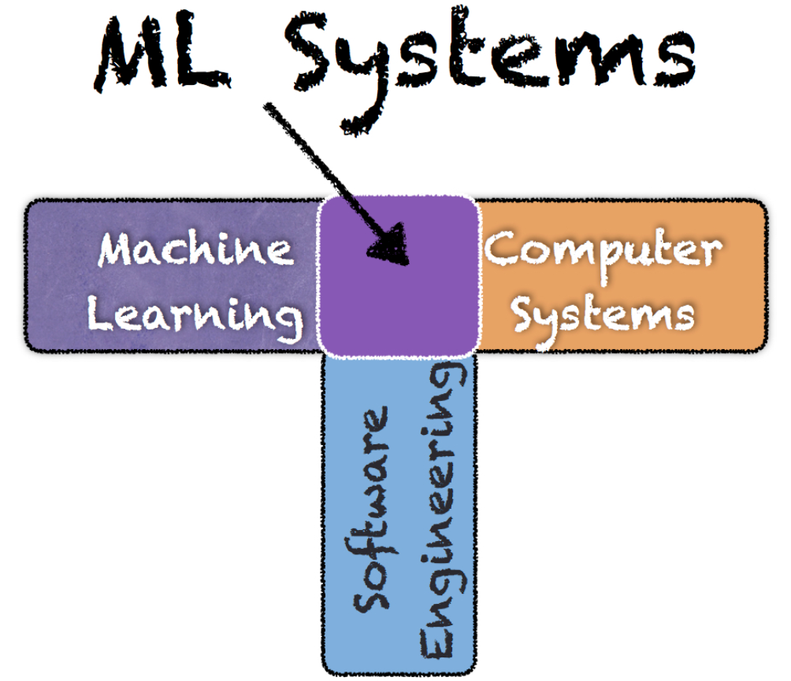

# Machine Learning Systems

course website: https://pooyanjamshidi.github.io/mls/

## Overview 

When we talk about Artificial Intelligence (AI) in general and Machine Learning (ML) in particular, we typically refer to a technique or an algorithm that gives the computer systems the ability to learn and to reason with data. However, there is a lot more to AI/ML than just implementing an algorithm or a technique. In this course, we will learn the fundamental differences between AI/ML as a technique versus AI/ML as a system in production. By the end of this class, I hope:
You will be able to apply state of the art ML algorithms, in whatever problem you are interested in, at scale and learn how to deal with unique challenges that only may happen when building real-world production-ready AI/ML systems.
You will be able to do AI at the Edge; there will be projects for an end-to-end, cloud-to-edge, hardware + software infrastructure for facilitating the deployment of AI-based solutions using Edge TPU/NVIDIA Jetson Nano and TensorFlow Lite.
I also hope I can convey my own excitement about AI/ML systems to you.
You are well qualified for doing research in AI/ML systems.

## Lectures

- Lecture 1: Course Introduction: Machine Learning Systems
  - tl;dr: This lecture reviews course requirement, learning goals, policies, and expectations.
- Lecture 2: Introduction to Machine Learning Systems (Uber Case Study)
  - tl;dr: This lecture reviews challenges of building a real-world ML system that scales.
  - [COTA: Improving Uber Customer Care with NLP & Machine Learning](https://eng.uber.com/cota/)
  - [Scaling Uber’s Customer Support Ticket Assistant (COTA) System with Deep Learning](https://eng.uber.com/cota-v2/)
- Lecture 3: Machine Learning Systems: Challenges and Solutions
  - tl;dr: This lecture reviews reactive strategies to incorporate ML-based components into a larger system.
- Lecture 4: Optimization and Neural Nets
  - tl;dr: This lecture builds the foundation of optimization and deep learning.
- Lecture 5: Learning Theory
  - tl;dr: This lecture reviews basic concepts related to statistical learning theory (e.g., hypothesis space).
- Lecture 6: Deep Convolutional Neural Networks
  - tl;dr: This lecture builds the foundation of deep learning systems.
- Lecture 7: Deep Learning System Stack
  - tl;dr: This lecture reviews the full-stack deep learning system development.
- Lecture 8: Backpropagation and Automatic Differentiation
  - tl;dr: This lecture reviews backprop and automatic differentiation.
- Lecture 9: High-Performance Hardware for Deep Learning
  - tl;dr: This lecture reviews hardware backends for deep learning.
- Lecture 10: Optimization and Performance Understanding of ML Systems
  - tl;dr: This lecture discusses performance optimization of machine learning systems.
- Lecture 11: Lecture 10: Compressing Deep Neural Networks: Pruning and Quantization
  - tl;dr: This lecture discusses DNN model compression techniques.
- Lecture 12: Machine Learning Platforms
  - tl;dr: This lecture reviews a platform that facilitates building an ML pipeline in production at scale.
- Lecture 13: Scalable Machine Learning
  - tl;dr: This lecture introduces variations of gradient descent and ideas how to it scale up using parallel computing.
- Lecture 14: Distributed Machine Learning
  - tl;dr: This lecture introduces how to scale up deployment (over multiple nodes) to speed up training and inference.
- Lecture 15: Recurrent Neural Networks
  - tl;dr: This lecture studies RNNs and LSTM architectures for predicting rare events.
- Lecture 16: Intrinsic Dimension
  - tl;dr: This lecture introduces the concept of instrinsic dimension and its implications for model compression.
- Lecture 17: Transfer Learning
  - tl;dr: This lecture discusses transfer learning to enable understanding performance of machine learning systems.

## Projects

- Project 1: Design Space Exploration of Deep Neural Networks
  - tl;dr: How the choice of configuration options (e.g., CPU frequency) affect inference time and energy?
- Project 2: Design Space Exploration of Distributed ML
  - tl;dr: How the choice of configuration parameters in distributed ML affect training time?
- Project 3: Design Space Exploration of Model Serving
  - tl;dr: How you can decrease latency of model serving by changing configurations such as caching?
- Project 4: Accelerating Deep Reinforcement Learning
  - tl;dr: The aim of this project is to utilize computer system capability to accelerate training of Deep RL agents.